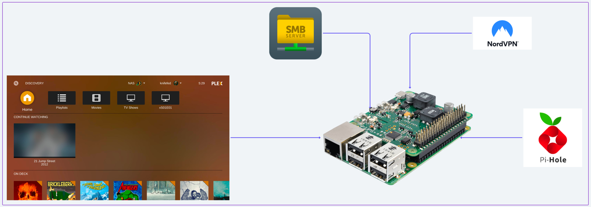

<!-- PROJECT LOGO -->
 

  

  <h3 align="center">Life of [raspberry] Pi</h3>

  

    My (always evolving) MEGA-HOME-SERVER pi configuration
  

<!-- TABLE OF CONTENTS -->

  
Table of Contents

  <ol>
    <li><a href="#about-the-project">About the Project</a></li>
    <li><a href="#prerequisites">Prerequisites</a></li>
    <li><a href="#installation">Installation</a></li>
    <li><a href="#roadmap">Roadmap</a></li>
    <li><a href="#license">License</a></li>
  </ol>

<!-- About the Project -->

# About the Project

This is my guide to setting up a raspberry pi home server that performs (but is not limited to) the following functions:
* Local file server
* Remote file server
* Plex Media Server
* Home VPN
* LAN Adblock
* Firewall
* Automated back-ups
* ... and then some

#### Why?
Every once in a while, an experiment blows up in my face and I end up spending a week getting everything back to normal,
because I never bothered noting down all the work as I'm doing it. This guide should serve as, both a record of all the 
configs, and possibly the start of some automated scripting-configing-recovery-ing-thingamajig.

<!-- GETTING STARTED -->
## Prerequisites

To get going, you need the following:
* A Raspberry Pi 🥧
  * Mine's a 4B. Technically, any [Pi model](https://support.plex.tv/articles/200375666-plex-media-server-requirements/) would do.
* A microSD Card ([min 32gb Class 10](https://www.tomshardware.com/best-picks/raspberry-pi-microsd-cards)) 💾
  * Get a good SD card, I've gone the cheaper route and that resulted in one of my reinstall-hell iterations
* A microSD Card Reader 💾
* Internet Access 🤷‍
* Wired or 2.4GHz USB Keyboard and Mouse 🖱️⌨️
  * [No wired keyboard / mouse?](./readmes/PIOS.md#dont-have-wired-keyboard--mouse-halp)
* Coffee ☕️

## Installation

* [Install and configure Pi OS](readmes/PIOS.md)
* [Setup File Sharing](readmes/SMB.md)
* [Install and configure Plex](readmes/Plex.md)
* [Set up auto backups](readmes/BackUP.md)

## Roadmap

- [x] Base piOS
- [x] Samba File Server
- [x] Plex Media Server
- [ ] Nord VPN
- [ ] PiHole DNS Sinkhole (Firewall & AdBlock)
- [x] Backups
- [ ] Jellyfin (opensource) Media Server
- [ ] Some other (opensource) VPN with mesh-net support
- [ ] Script base configurations

<!-- LICENSE -->
## License

Distributed under the GNU License. See [LICENSE.txt](LICENSE) for more information.
