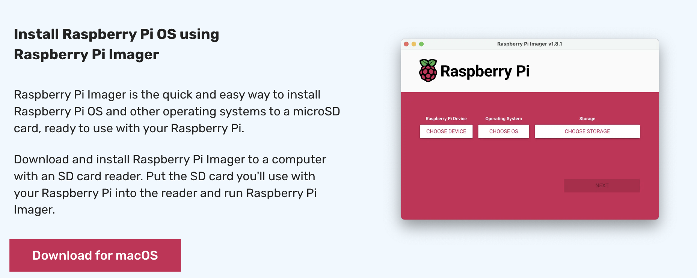
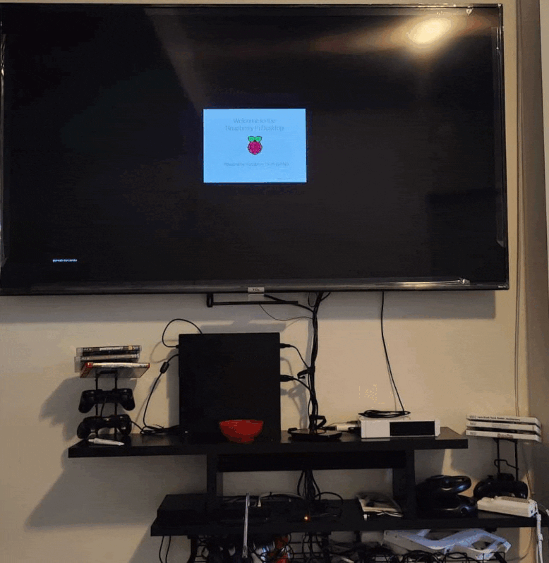

# Pi OS 
## Operating System & Flashing
#### ≈ 10-15 min depending on internet connection
There's 2 ways to do this.
* You could either [download the OS](https://www.raspberrypi.com/software/operating-systems/) manually and flash your SD card


* OR, you could go the easier route and have [Pi OS Manager](https://www.raspberrypi.com/software/) do the job. <br/>


* Right before flashing the SD card, you have the option (`CMD` + `SHIFT` + `X` if you can't see this section) to pre-configure the wireless SSID configs such that the device 
connects to the Wi-Fi as soon as install is complete
* Life would be **SIGNIFICANTLY** easier if you set up SSH as part of the flashing config:
  * In the same "OS Customisation" menu, enable and set up SSH in the "SERVICES" tab
  

## Installation
#### ≈ 5 - 10 min, reboots a few times
* Insert the SD Card and get started. It should start installing automatically

* You WILL need some USB connected (wired / 2.4GHz USB) keyboard and mouse if you are trying to use the GUI to set
  things up. With a bluetooth keyboard / mouse, you still need some connected interface to select and connect to bluetooth

### Don't have wired keyboard / mouse, Halp
Setting up SSH, as mentioned above, might help if you do not have a wired setup. Once flashed with SSH turned on and 
booted, you should be able to SSH into it and [connect to bluetooth](https://www.baeldung.com/linux/bluetooth-via-terminal) 
devices via terminal 🤷‍♀️

### SSH into the pi if not directly connected
There're a few ways to do this.
1. You can SSH into the pi using `username@hostname.local`, where `username` and `hostname` would be the whatever was
  configured in the `GENERAL` tab during the flashing stage. By default, these would be `pi` and `raspberrypi` ->
  `ssh pi@raspberrypi.local` or something like that. This will prompt for the password defined during flashing
2. You can log into your router and check the connected devices to find the IP Address of the pi now connected to the
  router and SSH using the username and the IP address, e.g.: `ssh pi@192.168.0.152`

### Install basic tools
```shell
sudo apt-get install vim  # editor
sudo apt-get install stress  # stress test CPUs
sudo apt-get install ntfs-3g  # support (microsoft) NTFS drives - incase piOS does not have native support
sudo apt-get install exfat-fuse exfat-utils  # support exFAT drives - incase piOS does not have native support
```
* There are a few files you need to edit, I find VIM the easiest to use. Here's a [cheat sheet](https://vim.rtorr.com/).
  The most important controls to remember are 
  * `i` to start editing ("insert")
  * `:` to get out of editing mode and perform other functions like save / quit (any function follows the `:` char)
  * `w` to save ("write")
  * `q` to quit (`wq` to save and quit)
  * `q!` to quit without saving
### Some more Configs
* Add users if user-level access control is required for shared folders
  ```shell
  sudo adduser my_user_name
  ```
* Set up a static IP
Add the text `ip=YOUR_IP_ADDRESS` to the `cmdline.txt` file.
```shell
hostname -I  # to get your current IP address, e.g. 192.168.0.152
sudo vim /boot/cmdline.txt
```
Paste the IP address at the bottom
```test
ip=192.168.0.152
```
```shell
sudo reboot  # restart
```