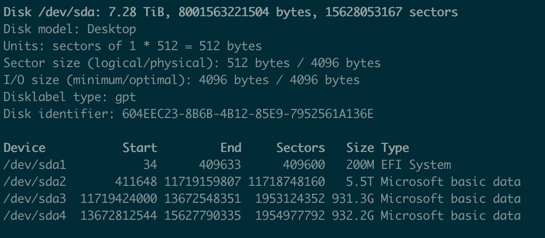
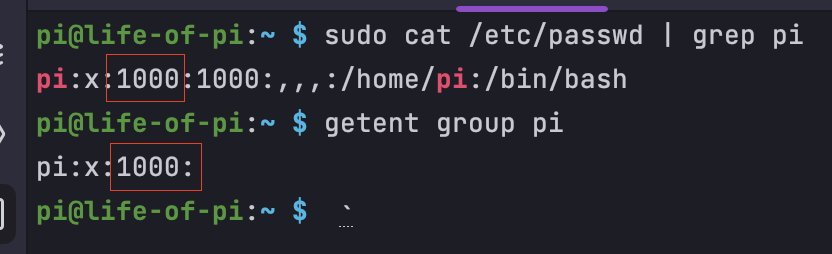
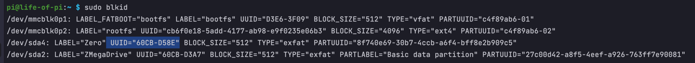

# SMB Share 

## Pre-requisites
* [PIOS installed](../readmes/PIOS.md)
## Instructions
* Update Pi
```shell
sudo apt-get update
sudo apt-get upgrade
```
* Install
```shell
sudo apt-get install samba samba-common-bin
```

* Make directories and configure Samba share
```shell
mkdir /home/folder/to/share
sudo vim /etc/samba/smb.conf
```
append to the bottom:
```text
[nameofshare]
path = /home/folder/to/share
writeable=Yes
create mask=0777
directory mask=0777
public=no
```

* Create Samba Users & restart
```shell
sudo smbpasswd -a pi  # will prompt password creation
sudo systemctl restart smbd
```

## Connecting an External Disk
* Identify the correct disk and partition name `(/dev/sdaX)`
```shell
sudo fdisk -l
```

* Create directory(ies) to mount the disk(s) on to<br/>
  *Gotcha*: using `sudo` to make your directories here changes the folder ownership to `root` user which really messes
  up the access control for private folders shared over the network
```shell
mkdir /media/USB
mkdir /media/USB/share
```
* Fix Permissions
```shell
sudo chmod -R 777 /media/USB/share
```

* Mount the disk to the folder ([Check "auto mount" below](#auto-mount-at-startup))
```shell
sudo mount -t auto /dev/sdaX /media/USB/share/
```

* Add shared folder config to Samba config
```shell
mkdir /home/folder/to/share
sudo vim /etc/samba/smb.conf
```
append to the bottom:
```text
[usbsharefoldername]
comment = share
path = /media/USB/share
writeable = yes
guest ok = yes
create mask = 0777
directory mask = 0777
force user = pi
```
## Auto mount at startup
You can set up mounting instructions in `/etc/fstab` to ensure all disks are mounted correctly at boot. Disks that are
meant to be publicly accessible to any user can be uploaded using any user ID. If specific users are meant to own specific
disk shares, that user's ID (and the intended group's ID) should be specified while mounting the disk
1. Get the user's(s) ID
   ```shell
   sudo cat /etc/passwd | grep my_user_name  # -> 1000
   sudo getent group pi  # -> 1000
   ```
   
2. Get the disk's(s) UUID and disk(s) type
   ```shell
   sudo blkid
   ```
   TYPE is `exfat` in this example
   
3. Make an entry in `/etc/fstab` for as many disks as needed
   ```shell
   sudo vim /etc/fstab
   ```
   ```text
   UUID=UUID-NUMBER /media/USB/share exfat defaults,uid=1000,gid=1000,umask=022,rw,nofail 0 0  # -> this if for the first user's disk
   UUID=UUID-NUMBER /media/USB/share2 exfat defaults,uid=1001,gid=1001,umask=022,rw,nofail 0 0  # -> assuming there's a second user's disk required
   ```
   Exit the editor with `ESC`, `:wq`, `ENTER`. [Understanding fstab.](https://linuxconfig.org/how-fstab-works-introduction-to-the-etc-fstab-file-on-linux)
4. Mount all drives
   ```shell
   mount -a
   ```
5. Reboot to test Auto Mount if needed
   ```shell
   sudo reboot  # this will reboot, so wait a while and ssh as needed
   sudo ls -lh /media/USB/share  # check to see if this lists out files and directories from the mounted disk
   ```

## Access control on shared folders
```shell
mkdir /media/USB/private_share  # create a folder to mount with password protect and mount required disk
```
* Inside of the same `/etc/samba/smb/conf` file referenced above, we can add one entry per share intended for sharing. The
configuration for a private or password protected share would be as follows:
   ```text
   [usbshareprivatefoldername]
   comment = private
   path = /media/USB/private_share
   writeable = yes
   guest ok = no  # not for guest accounts
   create mask = 0777
   directory mask = 0777
   force user = my_secure_user
   ```
* Create Samba users for `my_secure_user` with a password as detailed above
* Restart the samba service after any change `sudo systemctl restart smbd`
## Connecting to shared folders
Any client with SMB protocol should be able to connect to this network share.
* On macs, going to `Network` in Finder app will allow you to navigate to the raspberry pi share
* Windows, similarly, should have a network tab or something to view computers on the network
* Xplore is a great android app to connect to SMB drives